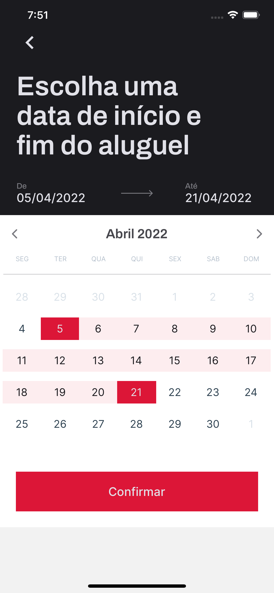

<h1 align="center">
An app with React Native using Expo
</h1>

 
 

<h3 align="center">
  
</h3>

 
 

### 📝 About the project
RentX is a car rental app. On the home page, the user will be able to see the list of cars available to rent, after selecting the desired car, they will go to the car page, where they will be able to see more information and select the period in which they would like to have the car rented. Then you will confirm the information and confirm the rental.
On the main page there will be a floating button where the user will be able to see the list of cars that are currently being rented.

 

<h3 align="center">
  
  
  
  
  
</h3>

 
 

<h3 align="center">
  Made with love by 💙 Leonardo Pacciulli
</h3>

  
  
  

